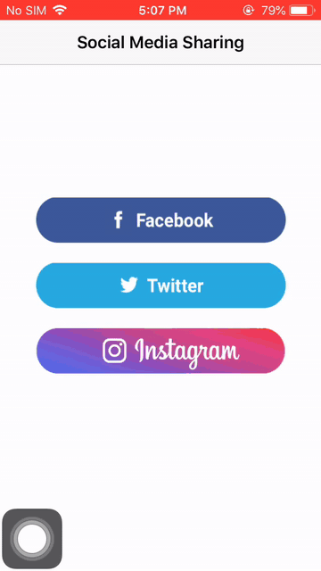

# Social Media Sharing

[](https://github.com/TankarShah07/SocialMediaSharing)
[](http://cocoapods.org/pods/SKToast)



## Description

There are several restrictions on social media platforms and due to that we are not able to share complete content 
which we actually willing to share.
So, SocialMediaSharing is an one stop social media sharing project. 
Just tap on sharing option and your content will be shared on social platform with just one simple click.

So here I have created 1 single project which combine 3 popular sharing media
1. Facebook
2. Twitter
3. Instagram

## Usage

Download project, or clone the repo, and run `pod install` from the root directory in terminal

After that,
Go to ```info.plist```  file and add your facebook app id (if you want to use facebook sharing) and twitter app consumer key and consumer secret (if you want to use twitter sharing)
also provide URL Types(refer image)


## Features

- One click sharing to popular social platforms


## Requirements

- iOS 9.0+
- Xcode 9.1+
- Swift 4.0+


## License

SocialMediaSharing is available under the MIT license. [See LICENSE](https://github.com/TankarShah07/SocialMediaSharing/blob/master/LICENSE) for details.
